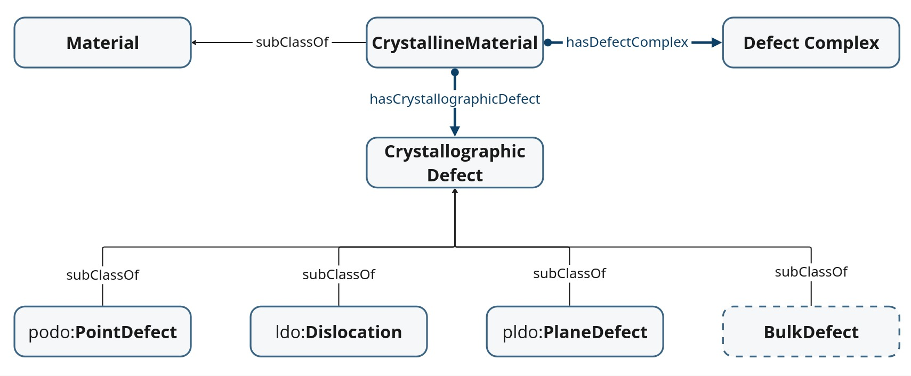

# Crystallographic Defect Core Ontology (CDCO)

CDCO defines the common terminology shared across all types of crystallographic defects, providing a unified framework for data integration in materials science.

* *Documentation*: https://ocdo.github.io/cdco/

## Acknowledgement
This work is developed at the Materials Data Science and Informatics (IAS‑9), Forschungszentrum Jülich GmbH. Supported by the NFDI-MatWerk consortium (Funded by the Deutsche Forschungsgemeinschaft (DFG, German Research Foundation) under the National Research Data Infrastructure – NFDI 38/1 – project number 460247524"). 